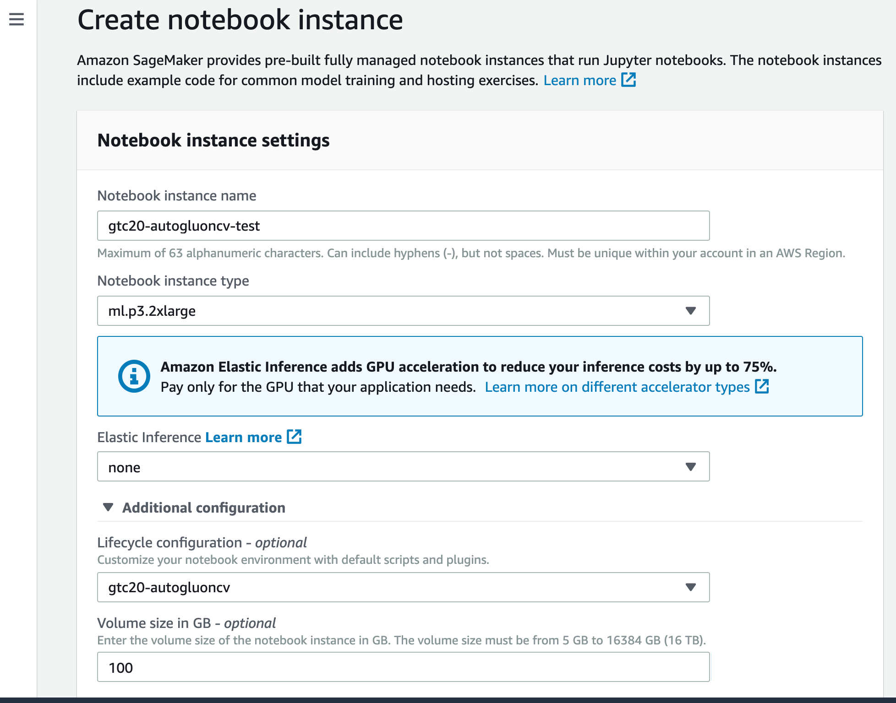
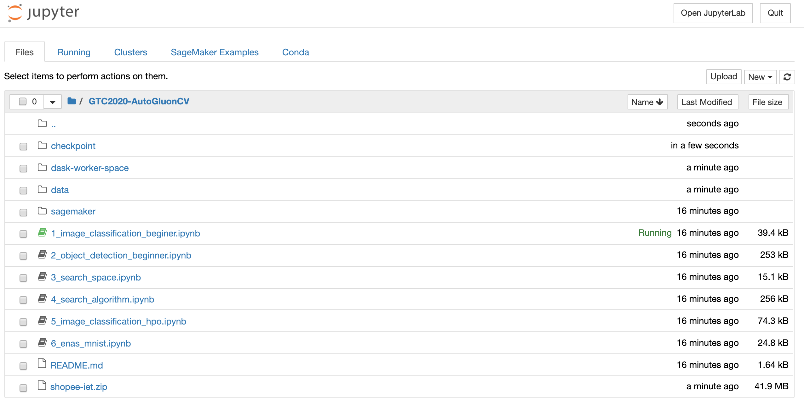

# GTC2020-AutoGluonCV

Materials for Nvidia GTC 2020: From HPO to NAS: Scalable autonomous deep learning for computer vision

# Setup on Amazon SageMaker

We will provide free access to p3 instances in the live webinar. For offline access please check out the follow steps to reproduce the working environment.

These steps takes less than 5 min to follow, and the only prerequisite is to own a AWS account with a working web browser.

## Create SageMaker lifecycle configuration
In AWS console, navigate to `sagemaker/notebook/Lifecycle configuration`

And create a new configuration

You can copy paste the configs from [start notebook](sagemaker/start_notebook.sh) and [create notebook](sagemaker/create_notebook.sh).

- [Create notebook](sagemaker/create_notebook.sh) defines the required libraries to install.
- [Start notebook](sagemaker/start_notebook.sh) defines the warmup operations that can help accelerate the notebooks we are trying to demo.

## Create SageMaker notebook
Once the lifecycle configuration is created, we can launch a new SageMaker notebook against the configuration.

- For `Notebook instance type`, choose `ml.p3.2xlarge` to enable GPU accelerated experience
- For `Additional configuration`, select the `gtc20-autogluoncv` we just created as `Lifecycle configuration`, and `100GB` for `Disk Volume` to ensure we won't run out of space.

# Run the notebooks
The notebook takes less than 10 minute to start, once it's online, we can click on `Open Jupyter` and direct to the notebooks.

# Delete notebook instance
You can stop and delete the SageMaker notebook instance to avoid bills for the running instance.
